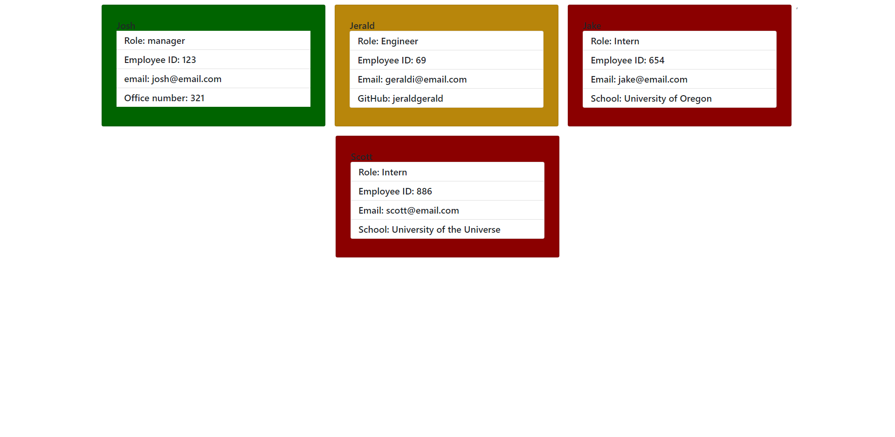

# My Team Profile Generator
  
  ## Description:
  ___
  An application using jest and inquirer to collect input fromt the user to build an html file. It takes in information about employees on a software engineering team. The application was built using jest for tests!
  ## Table of Contents:
  ___
  1) [Description](#description)
  2) [Install](#installation)
  3) [Usage](#usage)
  4) [Video](#video)
  5) [Collaboration](#collaboration)
  6) [Tests](#tests)
  7) [Questions?](#questions?)
  8) [GitHub](#gitHub)
  
  ## Installation
  ___
  Clone the repo. Confirm node.js is installed. Run npm install to get all the dependencies. Run node index.js and follow the questions in the command line.
  ## Usage
  ___
  To create a HTML page using information about a software engineering team.
  ## Video
  ___
  
  ## Collaboration:
  ___
  If you would like to help, please follow the [Contributor Covenant](https://www.contributor-covenant.org/)
  ## Tests
  ___
  N/A
  ## Questions?
  ___
  Please contact me at:
  My [GitHub](https://github.com/zaclark369)
  
  Or Email:
  <zacclark369@gmail.com>
  
  
